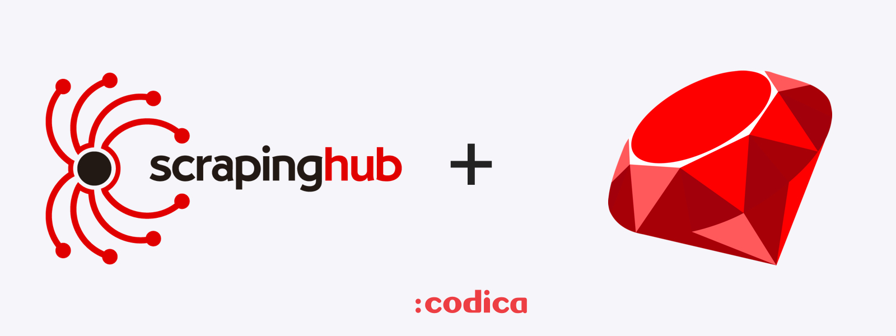
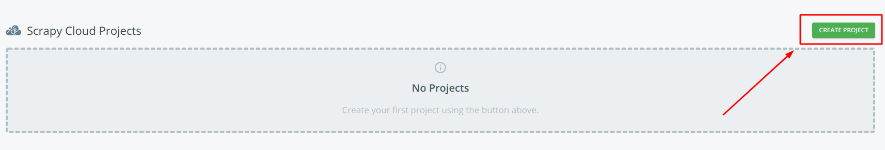
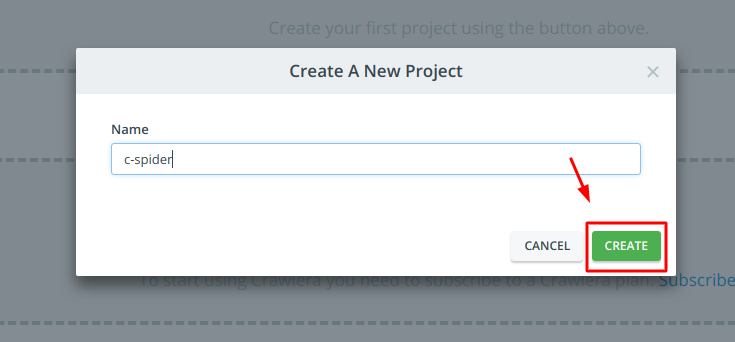
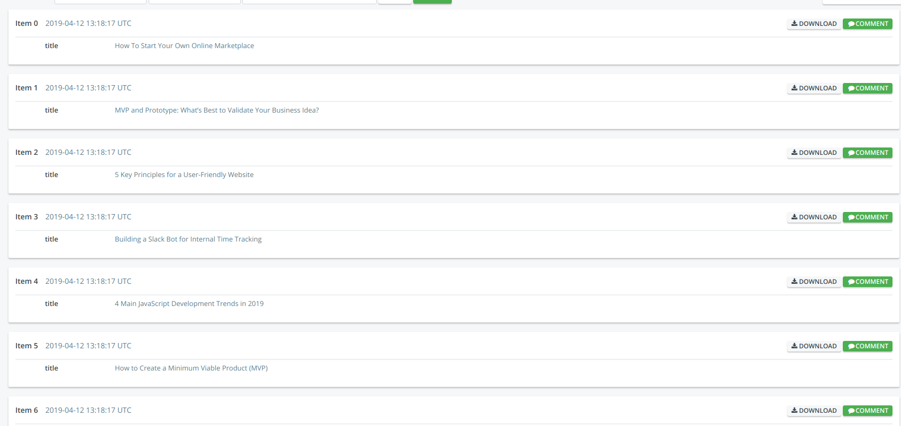

# Scrapinghub ruby example



[Scrapinghub Platform](https://scrapinghub.com/) is the most advanced platform for deploying and running web crawlers.

## Requirements

1. [Docker](https://docs.docker.com/install/) is a tool designed to make it easier to create, deploy, and run applications by using containers.
2. [shub](https://shub.readthedocs.io/en/stable/quickstart.html#installation) is the Scrapinghub command line client. It allows you to deploy projects or dependencies, schedule spiders, and retrieve scraped data or logs without leaving the command line.
3. [Scrapinghub account](https://app.scrapinghub.com/account/signup/)

## Step one: build your spider

> NOTE: make sure you meet the website rules before scraping it.

Let's imagine that we want to get a list of articles from the [Сodica](https://www.codica.com/blog/) website. I'll use [typhoeus](https://github.com/typhoeus/typhoeus) for HTTP requests and [nokogiri](https://github.com/sparklemotion/nokogiri) as HTML parser.

`app/crawler.rb`

```ruby
# require libraries
require 'typhoeus'
require 'nokogiri'
require 'json'

# determine where to write the result
begin
  outfile = File.open(ENV.fetch('SHUB_FIFO_PATH'), mode: 'w')
rescue IndexError
  outfile = STDOUT
end

# parse response
response = Typhoeus.get('https://www.codica.com/blog/').response_body
doc      = Nokogiri::HTML(response)

# select and save all titles
doc.css('.post-title').each do |title|
  result = JSON.generate(title: title.text.split.join(' '))
  outfile.write result
  outfile.write "\n"
end
```

Notes:

```ruby
...

begin
  outfile = File.open(ENV.fetch('SHUB_FIFO_PATH'), mode: 'w')
rescue IndexError
  outfile = STDOUT
end

...
```

Here we set up where to write results. Scrapinghub provides a `SHUB_FIFO_PATH` ENV variable to store items on the website. You can locally pass a filename to this ENV variable to write on a disk.

```bash
$> ruby app/crawler.rb

#=>
{"title":"How To Start Your Own Online Marketplace"}
{"title":"MVP and Prototype: What’s Best to Validate Your Business Idea?"}
{"title":"5 Key Principles for a User-Friendly Website"}
{"title":"Building a Slack Bot for Internal Time Tracking"}
{"title":"4 Main JavaScript Development Trends in 2019"}

...
```

## Step two: create required files by Scrapinghub

Docker image should be able to run via start-crawl command without arguments. `start-crawl` should be executable. At our project `start-crawl` is a `app/crawler.rb`. Second required file is `shub-image-info.rb`. Let's create it.

`app/shub-image-info.rb`
```ruby
require 'json'

puts JSON.generate(project_type: 'other', spiders: ['c-spider'])
exit
```

Just change `c-spider` name to your own.

## Step three: make required files executable

Add `#!/usr/bin/env ruby` to both `app/shub-image-info.rb` and `app/crawler.rb`. It makes these files executable.

## Step four: create Dockerfile

```Dockerfile
FROM ruby:2.5.1-stretch
ENV LANG=C.UTF-8

RUN apt-get update

COPY . /app

WORKDIR /app

RUN bundle install
RUN ln -sfT /app/shub-image-info.rb /usr/sbin/shub-image-info && \
    ln -sfT /app/crawler.rb /usr/sbin/start-crawl

RUN chmod +x /app/shub-image-info.rb /app/crawler.rb

CMD /bin/bash
```

It's a basic Dockerfile. We install a project and point our files to files that scrapinghub will look for to start parsing.

## Step five: deploy and start your spider

After you installed and logged in to shub, you need to create a project on the scrapinghub.




Copy project ID and create `scrapinghub.yml` file. You can read more about scrapinghub.yml [here](https://shub.readthedocs.io/en/stable/deploying.html?highlight=scrapinghub.yml).


`app/scrapinghub.yml`
```yml
projects:
  c-spider:
    id: YOUR_PROJECT_ID
    image: images.scrapinghub.com/project/YOUR_PROJECT_ID

version: spider-1
apikey: YOUR_API_KEY
```

And upload your spider.

```bash
shub image upload c-spider
```

After spider deployed, go to the scrapinghub dashboard and run it. As a result, you will have something like this.



And now you can access your scrapped data with [Items API](https://doc.scrapinghub.com/api/items.html).

## License

Copyright © 2015-2019 Codica. It is released under the [MIT License](https://opensource.org/licenses/MIT).

## About Codica

[](https://www.codica.com)

We love open source software! See [our other projects](https://github.com/codica2) or [hire us](https://www.codica.com/) to design, develop, and grow your product.
